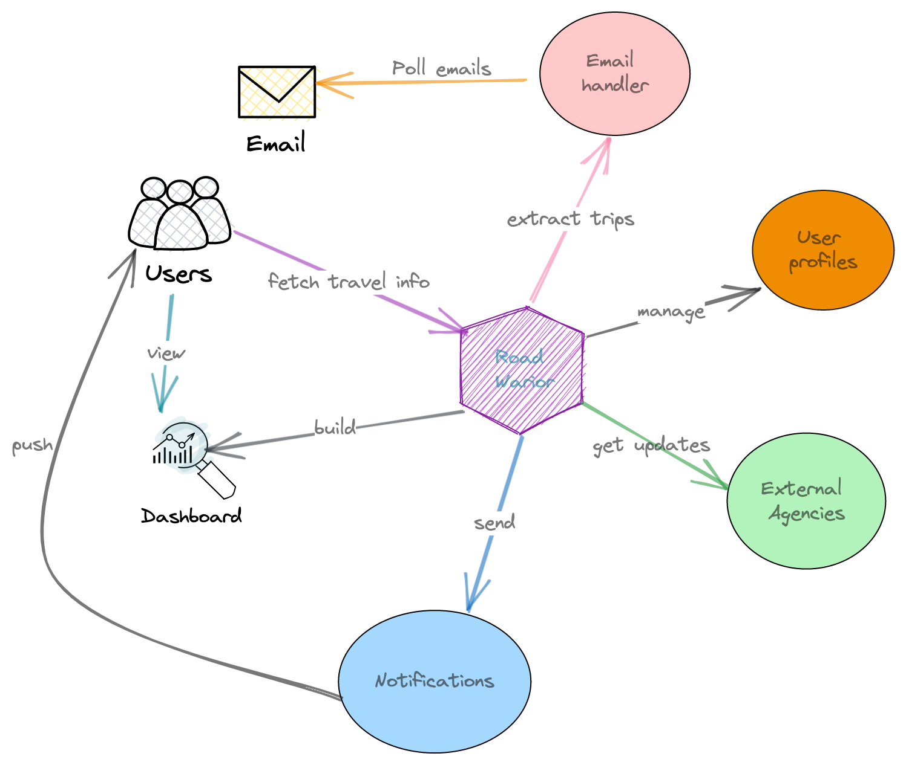

# Road Warior - Oreilly Architectural Kata 2023

## Table of Content
- [Road Warior - Oreilly Architectural Kata 2023](#road-warior---oreilly-architectural-kata-2023)
	- [Table of Content](#table-of-content)
	- [Overview](#overview)
	- [Terminology](#terminology)
		- [Unique Value Proposition](#unique-value-proposition)
		- [Target Audience](#target-audience)
	- [Rollout Plan](#rollout-plan)
		- [Phase 1: The MVP](#phase-1-the-mvp)
		- [Phase 2: A solid product](#phase-2-a-solid-product)
		- [Phase 3: Premium Experience](#phase-3-premium-experience)
	- [Architecture](#architecture)
		- [Key Architectural Characteristics](#key-architectural-characteristics)
		- [Architectural Style](#architectural-style)
		- [Component Diagram](#component-diagram)
	- [Sequence Diagrams](#sequence-diagrams)

## Overview

The Road Warrior is the next generation online trip management dashboard. It allows travelers to see all of their existing reservations organized by trip  online and through their mobile devices.

## Terminology
| Abbreviation |    Meaning|
| :-- | :-- |
| Reservation | Booking of travel, hotel or car rental |
| Trip | A sequence of reservations usually including travel to and from destination in addition to hotel reservation and car rental. A trip might cover multiple destinations. |
| Agency | A travel agency that takes care of travel reservations, hotel reservations and/or car rentals |
| GDS | Global Distribution Service - large aggregators that provide unified API access to query and interact with many travel agencies. |

### Unique Value Proposition
**Up to date travel information about all customer travel activities from all sources with zero hassle!**
 - Very fast updates (faster than competition).
 - Unified dashboard covering travel, hotels, car rentals and more ... from ALL agencies
 - Auto-magical experience

### Target Audience
- Business Travelers
- Frequent Travelers

## Rollout Plan
As a startup, it is crucial to rollout out the system quickly and iteratively, starting with the most important business bets. It is also important to maximize the value provided to customers without letting costs run loose. 

The following rollout plan is only a starting point that reflects our current understanding and assumbtions. It should - and most defintely will - change as we gain deeper understanding of our customers and their needs.

> [!IMPORTANT]  
> The 3 phases are only meant as markers for major milestones. The system will be developed in small iterative chunks inline with agile best practices.
### Phase 1: The MVP
In this phase, we focus on components that provide the core functionality with the least cost and complexity, allthewhile providing substantial value to our early adaptor. Since the user base is still small during this phase, we can afford not having all the automations and scaling features. 

### Phase 2: A solid product
In this phase we make sure that all the core functions are in place. We introduce components that handle rare scenarios (ex: reservations that are not available through GDS) and optimise resource usage (ex: distribute our queries among multiple agencies to avoid throttling and penalties).

### Phase 3: Premium Experience
In this phase, we provide magical experience. The system anticipates the user needs and proactively caters for them. A user may give us access to their inbox and literally never have to worry about missing a gate change or getting lost trying to find their next connection when they have no internet connection in a foreign airport.

## Architecture
### Key Architectural Characteristics
| Characteristic     | Definition | Reason |
| :-------------     | :--------- | :----- |
| **Scalability**    | The system can accommodate the expected load, including 2 million active users per week and 15 million user accounts.       | To support the business growth plans of a fast growing startup.|
|**Iterability**     |Minimise time to market and enable fast iteration speed for new features.         |Validating business hypothesis, generating revenue, hitting the market before competition and pivoting when needed are are crucial for a startup's success.|
| **Low Latency**    | Minimize latency for real-time updates and interactions with external systems, such as airline, hotel, and car rental interfaces.           | "Faster updates than competition" is part of our UVP       |
| **Availability**   |Ensure the system is accessible at all times with a maximum of 5 minutes per month of unplanned downtime.         | Explicit business requirement.|
| **Responsiveness** | The system responds to user interactions almost immediately           | "Magical user experience" is part of our UVP.       |

### Architectural Style
The overarching Architectural Style for the system is Microservices whereas Event Driven Architecture [(Event-Carried State Transfer)](https://martinfowler.com/articles/201701-event-driven.html) and CQRS are used when approperiate.

For more details on the reasoning behind the decision, please check [ADR001](<ADRs/ADR001 - use Microservice Architecture.md>).

### Component Diagram

> [!NOTE]
> It is assumed that all backend components implicitly take care of hygine concerns such as logging, monitoring and analytics. Thus, these are not shown in the diagram in order to avoid unnecessarily crowding it.
> An exception is made for the frontend where sending out tracking and analytics data is typically done through a dedicated component which is shown in the diagram.

**Email Receiver Service**
| Component                | Responsibilities                                                                                                                                                                                                                                                 | Phase   | Notes  |
| :----------------------- | :--------------------------------------------------------------------------------------------------------------------------------------------------------------------------------------------------------------------------------------------------------------- | :------ | :----- |
| Email Credentials Keeper | Securely saves the email credentials for users who opted to give us access to their inboxes.                                                                                                                                                                     | Phase 3 |        |
| Email Poller             | Periodically polls users’ inboxes to check for new emails.                                                                                                                                                                                                       | Phase 2 |        |
| Email Picker             | Cherry picks travel emails from users’ inboxes.                                                                                                                                                                                                                  | Phase 3 |        |
| Forwarded Email Receiver | Receives forwarded emails from users who opted to forward their emails to us.                                                                                                                                                                                    | Phase 2 |        |
| Email Parser             | Parses the picked emails to extract booking references and any IDs needed to retrieve reservation details from agency and GDS APIs. Once a booking reference is extracted, it is published to the new_reservations queue to be processed by Reservations Updater | Phase 2 | [ADR003](<ADRs/ADR003 - parse emails for booking reference only.md>) |

**Reservations Service**
| Component                     | Responsibilities                                                                                                                                                                                                                                                                                        | Phase   | Notes          |
| :---------------------------- | :------------------------------------------------------------------------------------------------------------------------------------------------------------------------------------------------------------------------------------------------------------------------------------------------------ | :------ | :------------- |
| Reservations Update Scheduler | Schedules tasks to check and update upcoming reservations. When a reservation is due for update, this component send an asynchronous message to the Reservations Updater which carrier out the check & update process.                                                                                  | Phase 2 | [ADR008](<ADRs/ADR008-Reservation Updates Scheduler for Bookings without Event Subscription Support.md>), [ADR005](<ADRs/ADR005-Event Subscription for Reservation Updates.md>)                        |                                                                                                                                                                                                                                                                                                         |         |                |
| Reservations Updater          | Responsible for updating reservations. If the update is triggered from the scheduler, it queries the appropriate agency through Agencies Integration Service then persisting the result if there is an update. If the update is triggered from an event notification, it is persisted without querying. | Phase 1 | [ADR004](<ADRs/ADR004 - rely only on event subscription to receive booking updates.md>) |
| Reservations Reader           | Source of truth for reservation data.                                                                                                                                                                                                                                                                   | Phase 1 |                |

**Agencies Integration Service**
| Component             | Responsibilities                                                                                           | Phase   | Notes          |
| :-------------------- | :--------------------------------------------------------------------------------------------------------- | :------ | :------------- |
| Agency API Router     | Routes requests to the appropriate GDS or agency after figuring out which of them can fulfill the request. | Phase 1 |                |
| GDS Integrator        | Provides standardized access to all GDS’s.                                                                 | Phase 1 |                |
| Agency Integrator     | Provides standardized access to all agencies.                                                              | Phase 2 |                |
| GDS Updates Listener  | Listens to event notifications from GDS’s and pushes them through a queue to the Reservations Updater.     | Phase 1 | [ADR008](<ADRs/ADR008-Reservation Updates Scheduler for Bookings without Event Subscription Support.md>), [ADR005](<ADRs/ADR005-Event Subscription for Reservation Updates.md>) |
| Agency Support Router | Decides on which URL to redirect the user to for support requests.                                         | Phase 3 |                |	

**Trips Service**
| Component                    | Responsibilities                               | Phase   | Notes  |
| :--------------------------- | :--------------------------------------------- | :------ | :----- |
| Trips Composer               | Composes trips as collections of reservations. | Phase 1 | [ADR007](<ADRs/ADR007-Relying on Trip End Date to Determine Trip State.md>) |
| Trips Reader                 | Source of truth of Trips                       | Phase 1 | [ADR007](<ADRs/ADR007-Relying on Trip End Date to Determine Trip State.md>) |

**Account Service**
| Component         | Responsibilities                                               | Phase   | Notes |
| :---------------- | :------------------------------------------------------------- | :------ | :---- |
| Account Updater   | Creates and updates user accounts (username / password / 2FA). | Phase 1 |       |
| Authenticator     | Enables user login                                             | Phase 1 |       |
| Account Recoverer | Enables account recovery (“forgot my password”)                | Phase 1 |       |

**Profile Service**
| Component           | Responsibilities                             | Phase   | Notes |
| :------------------ | :------------------------------------------- | :------ | :---- |
| Profile Updater     | Update user profile information              | Phase 1 |       |
| Profile Reader      | Source of truth for user profile information | Phase 1 |       |
| Preferences Updater | Update user preferences                      | Phase 3 |       |
| Preferences Reader  | Source of truth for user preferences         | Phase 3 |       |

**Notification Service**
| Component            | Responsibilities                                                   | Phase   | Notes |
| :------------------- | :----------------------------------------------------------------- | :------ | :---- |
| Mobile Notifier      | Sends push notifications to user’s mobile phone(s)                 | Phase 2 |       |
| Web Notifier         | Send push notifications to user’s browser                          | Phase 2 |       |
| SMS Notifier         | Sends SMS notifications to user’s phone                            | Phase 3 |       |
| Notifications Broker | Decides which Notification channels to send a notification through | Phase 2 |       |

**Frontend**
| Component                   | Responsibilities                                                                                                                                                                          | Phase   | Notes  |
| :-------------------------- | :---------------------------------------------------------------------------------------------------------------------------------------------------------------------------------------- | :------ | :----- |
| Dashboard Composer          | Provides a single pane of glass view for the user showing all relevant information about their reservations and trips                                                                     | Phase 1 | [ADR006](<ADRs/ADR006-Elimination of a Backend for Frontend (BE for FE) Architecture.md>) |
| Metrics Publisher           | Publishes relevant events and metrics to the analytics service (for BE, this is assumed as part of each component’s functionality)                                                        | Phase 1 |        |
| Offline Cache Manager       | Maintains and updates an offline cache for information that is relevant within the next 7 days                                                                                            | Phase 2 |        |
| Context-aware Info Provider | Displays information based on current context. For example: GPS location, time of day, etc… May utilize the Offline Cache Manager to make sure the information will be there when needed. | Phase 3 |        |
| Trips Social Media Publisher | Publishes trip details to Social Media         | Phase 3 |        |

**Analytics Service**
| Component         | Responsibilities                      | Phase   | Notes |
| :---------------- | :------------------------------------ | :------ | :---- |
| Metrics Collector | Collects and persists analytics data. | Phase 1 |       |
| Reports Generator | Generates business reports.           | Phase 1 |       |

## Sequence Diagrams
Please find the sequence diagrams in [this folder](</iagrams/SequenceDiagrams/PNG>).